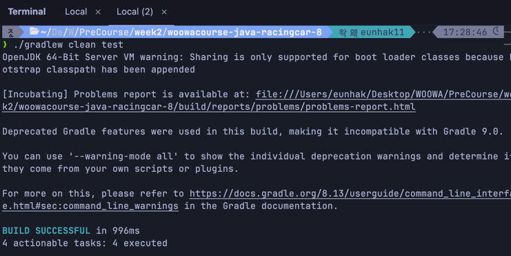
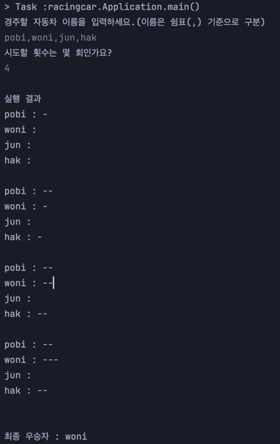

# java-racingcar-precourse

## 기능 목록

### 1단계: Car 클래스 구현 및 테스트
- ✅ Car 클래스 구현 (이름, 위치, 전진 기능)
- ✅ Car 클래스 테스트 작성

### 2단계: 입력 검증 기능 구현 및 테스트
- ✅ InputValidator 클래스 구현 (이름 검증, 시도 횟수 검증)
- ✅ InputValidator 테스트 작성 (정상 케이스 및 예외 케이스)

### 3단계: 입출력 기능 구현
- ✅ InputView 클래스 구현 (사용자 입력 처리)
- ✅ OutputView 클래스 구현 (게임 진행 상황 및 결과 출력)

### 4단계: 게임 로직 구현 및 테스트
- ✅ RacingGame 클래스 구현 (게임 진행, 우승자 결정)
- ✅ RacingGame 테스트 작성 (단독/공동 우승자 판별)

### 5단계: 컨트롤러 구현
- ✅ RacingGameController 클래스 구현 (게임 전체 흐름 제어, 예외 처리)

### 6단계: Application 연결
- ✅ Application 클래스에서 Controller 실행

### 7단계: 통합 테스트 및 리팩토링
- ✅ 전체 시나리오 테스트
- ✅ 코드 품질 개선 (indent depth, 함수 분리, 상수화)

### 8단계: 최종 점검
- ✅ 테스트 통과 확인 (`./gradlew clean test`)
- 
- ✅ 실행결과 확인
- 

## 사용 라이브러리
- `camp.nextstep.edu.missionutils.Randoms`: 무작위 값 생성용
- `camp.nextstep.edu.missionutils.Console`: 사용자 입력